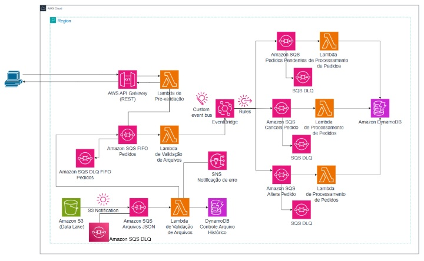
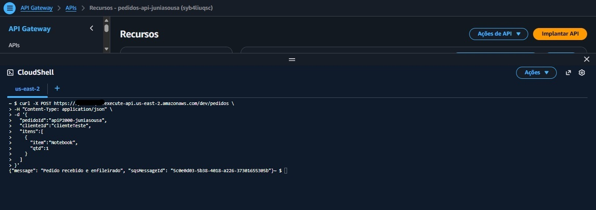
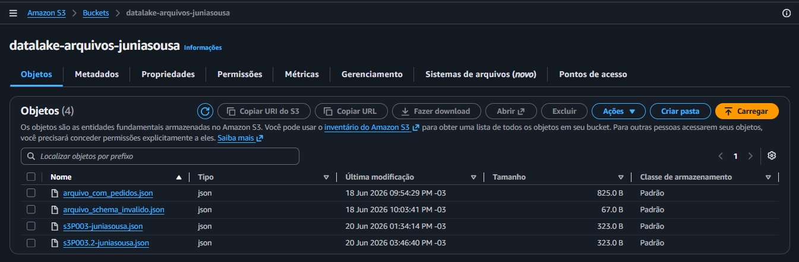
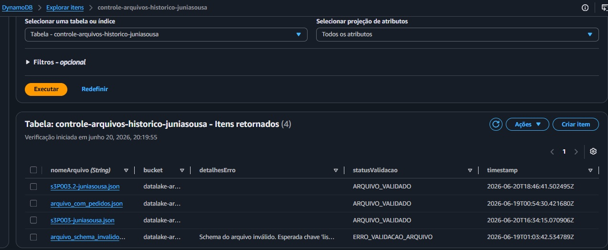
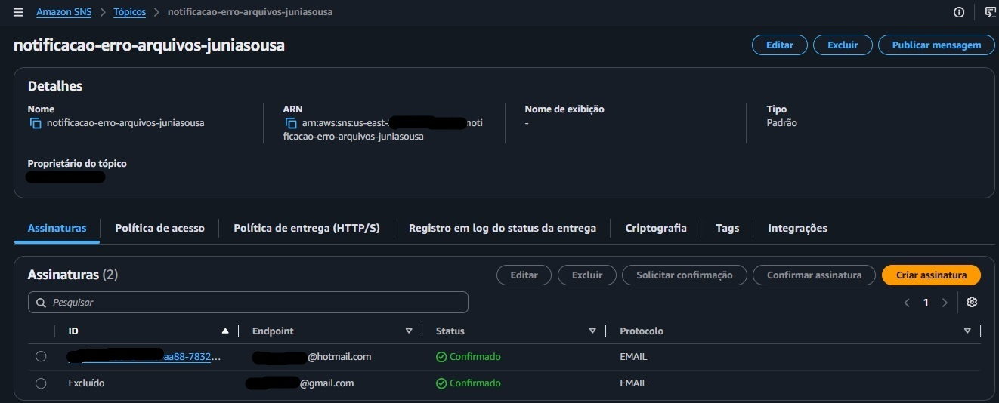
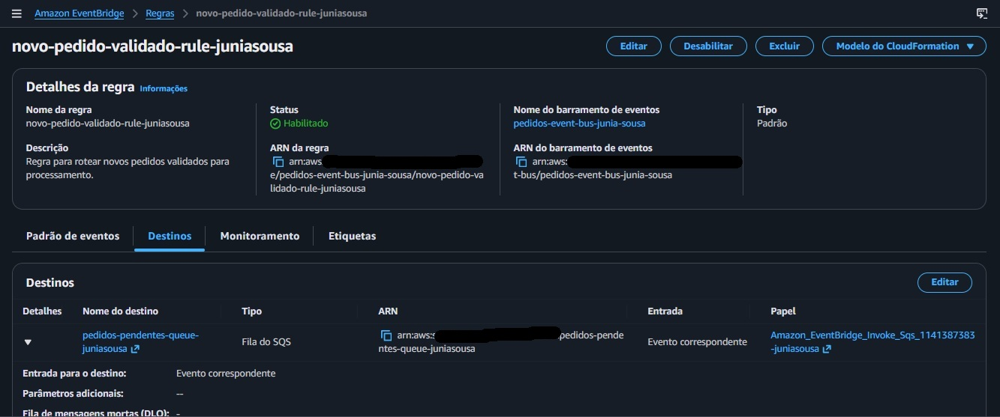
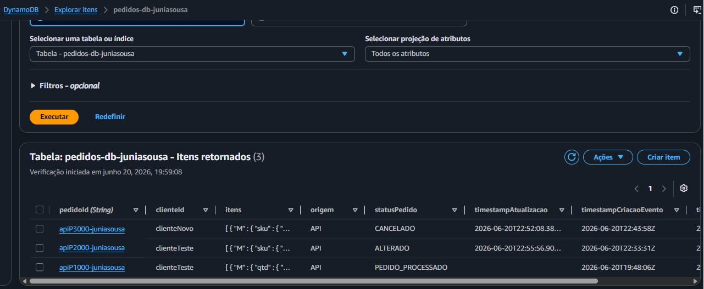
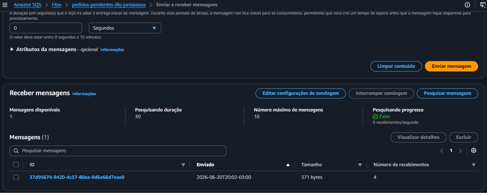
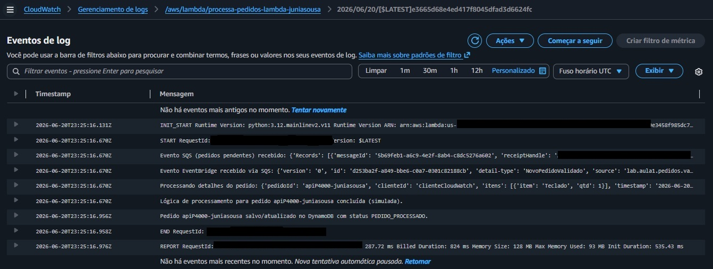

# AWS Order Management System

Sistema de gerenciamento de pedidos com processamento assíncrono e arquitetura orientada a eventos utilizando serviços AWS.

---

## Objetivo

Desenvolver um sistema de gerenciamento de pedidos capaz de receber, validar, processar, alterar e cancelar pedidos por meio de fluxos assíncronos e arquitetura orientada a eventos.

A solução foi implementada utilizando serviços gerenciados da AWS, permitindo múltiplos canais de entrada de pedidos, processamento desacoplado, persistência dos dados, notificações de erro e tratamento de falhas.

---

## Serviços Utilizados

* Amazon API Gateway
* AWS Lambda
* Amazon SQS FIFO
* Amazon SQS Standard
* Amazon EventBridge
* Amazon DynamoDB
* Amazon S3
* Amazon SNS
* Amazon CloudWatch
* AWS IAM

---

## Arquitetura

A solução foi desenvolvida utilizando uma arquitetura **Serverless** e **Event-Driven**, permitindo o processamento de pedidos por diferentes canais de entrada e garantindo escalabilidade, desacoplamento entre serviços e tratamento de falhas.

---

## Módulos do Sistema

| Módulo                | Responsabilidade                                   |
| --------------------- | -------------------------------------------------- |
| Pré-Validação         | Receber e validar pedidos enviados pela API        |
| Validação de Pedidos  | Consumir mensagens da fila FIFO e publicar eventos |
| Validação de Arquivos | Processar arquivos JSON enviados ao Amazon S3      |
| Processamento         | Persistir pedidos e atualizar status               |
| Alteração             | Atualizar pedidos existentes                       |
| Cancelamento          | Alterar status do pedido para cancelado            |
| Histórico             | Armazenar informações dos arquivos processados     |
| Notificações          | Enviar alertas de erro utilizando Amazon SNS       |

---

## Funcionalidades

* Cadastro de pedidos via API REST.
* Importação de pedidos através de arquivos JSON armazenados no Amazon S3.
* Pré-validação de pedidos utilizando AWS Lambda.
* Processamento assíncrono utilizando Amazon SQS FIFO e SQS Standard.
* Publicação e roteamento de eventos utilizando Amazon EventBridge.
* Persistência dos pedidos no Amazon DynamoDB.
* Controle do histórico de arquivos processados.
* Alteração de pedidos existentes.
* Cancelamento de pedidos.
* Notificações automáticas de erros utilizando Amazon SNS.
* Tratamento de falhas utilizando Dead Letter Queues (DLQs).
* Monitoramento e rastreamento através do Amazon CloudWatch.

---

## Aprendizados

* Desenvolvimento de aplicações Serverless na AWS.
* Arquitetura orientada a eventos (Event-Driven Architecture).
* Integração entre API Gateway, Lambda, SQS e EventBridge.
* Processamento assíncrono utilizando filas FIFO e Standard.
* Persistência de dados no Amazon DynamoDB.
* Processamento de arquivos utilizando Amazon S3.
* Tratamento de falhas com Dead Letter Queues (DLQs).
* Notificações automáticas utilizando Amazon SNS.
* Configuração de permissões utilizando AWS IAM.
* Monitoramento e troubleshooting com Amazon CloudWatch Logs.

---

## Evidências

### Teste da API REST

Envio de um pedido através da API REST e resposta retornada pela aplicação.

---

### Upload de Arquivos no Amazon S3

Bucket contendo arquivos JSON enviados para processamento.

---

### Histórico de Arquivos no DynamoDB

Registro dos arquivos processados e seus respectivos status.

---

### Notificações SNS

Notificação automática de erro durante a validação de arquivos.

---

### Regras do EventBridge

Regra responsável pelo roteamento dos eventos de pedidos.

---

### Pedidos Armazenados no DynamoDB

Persistência dos pedidos e atualização dos seus estados ao longo do ciclo de vida do sistema.

Exemplos de status:

* PEDIDO_PROCESSADO
* ALTERADO
* CANCELADO

---

### Dead Letter Queue (DLQ)

Mensagens que não puderam ser processadas com sucesso são encaminhadas para a DLQ para análise posterior.

---

### Logs no CloudWatch

Monitoramento das execuções das funções Lambda e rastreamento do fluxo de processamento.

---

## Resultado

Neste projeto foi desenvolvido um sistema de gerenciamento de pedidos baseado em arquitetura **Serverless** e **Event-Driven** utilizando serviços da AWS.

A solução implementa múltiplos canais de ingestão de dados, incluindo API REST e arquivos JSON armazenados no Amazon S3, realizando validações assíncronas com AWS Lambda e Amazon SQS, roteamento de eventos através do Amazon EventBridge e persistência dos dados no Amazon DynamoDB.

Além do fluxo principal de processamento, foram implementados fluxos de alteração e cancelamento de pedidos, mecanismos de tratamento de falhas com Dead Letter Queues e notificações automáticas utilizando Amazon SNS.

O projeto permitiu aplicar conceitos de **desenvolvimento Back-end**, **arquitetura distribuída**, **processamento assíncrono** e **integração entre serviços AWS**, simulando um cenário próximo ao encontrado em ambientes corporativos.
